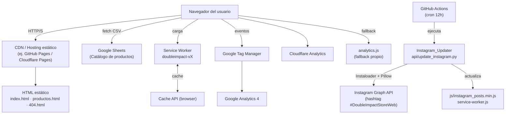
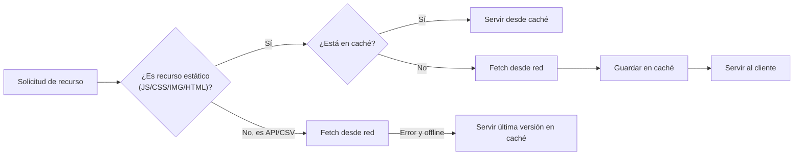
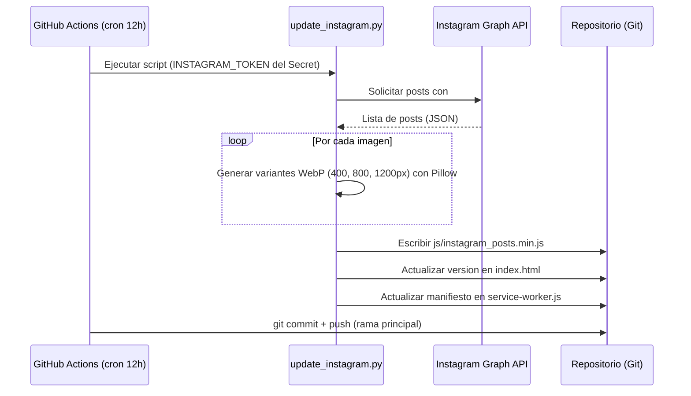

# Design Document — DoubleImpactStore

## Overview

DoubleImpactStore es una tienda en línea de videojuegos retro originales. Es la evolución directa del sitio RopavejeroRetro.cl, conservando su arquitectura y funcionalidades probadas, pero con identidad de marca completamente actualizada y soporte de marca compartida entre `@Ropavejero.Retro` y `@nekketsustore`.

### Pila tecnológica

| Capa | Tecnología |
|---|---|
| Frontend | HTML5 semántico + CSS3 (variables, grid, flexbox) + JavaScript ES Modules (Vanilla) |
| Íconos | Font Awesome 6.5.1 — instalado localmente en `css/font-awesome_6.5.1_all.min.css` (sin CDN externo) |
| Datos / Catálogo | Google Sheets publicado como CSV (sin backend propio) |
| Imágenes | WebP con variantes responsive (400 / 800 / 1200 px) |
| PWA | Service Worker + Web App Manifest |
| Automatización | Python (Pillow) + GitHub Actions |
| Analytics | Google Tag Manager → GA4 + Cloudflare Analytics + fallback propio |
| Build / Minificación | Node.js `watcher.js` (script custom) |
| SEO | Schema.org JSON-LD + Open Graph + Twitter Cards + sitemap.xml |

El sitio es completamente estático: no hay servidor de aplicaciones, base de datos propia ni API propia. Todo el estado de sesión vive en `localStorage` del navegador.

---

## Architecture

### Vista de alto nivel



### Principios de diseño

1. **Sin backend propio**: Google Sheets es la única fuente de datos mutable. Esto elimina costos de servidor y complejidad de despliegue.
2. **Progressive Enhancement**: el sitio es funcional sin JavaScript habilitado (contenido en HTML estático), y JavaScript añade interactividad.
3. **Cache-first con versioned invalidation**: el Service Worker sirve todos los recursos desde caché y se auto-invalida al cambiar el nombre de versión.
4. **Módulos ES desacoplados**: cada módulo JS tiene una única responsabilidad. `index.js` solo orquesta; no contiene lógica de negocio.
5. **Multilenguaje en runtime**: los textos de la interfaz se almacenan como objetos de traducción en `ui.js` y se aplican dinámicamente; no se requieren páginas duplicadas.

---

## Components and Interfaces

### Estructura de archivos

```
/
├── index.html                     # Página principal
├── productos.html                 # Catálogo completo
├── 404.html                       # Página de error
├── security-policy.html           # Política de divulgación responsable
├── security-acknowledgments.html  # Agradecimientos de seguridad
├── manifest.json                  # Web App Manifest (PWA)
├── service-worker.js              # Service Worker
├── sitemap.xml
├── robots.txt
├── .htaccess                      # URLs limpias y cabeceras de seguridad
├── .well-known/
│   └── security.txt
├── img/
│   ├── LogoDoubleImpactStore_100%.png
│   ├── LogoDoubleImpactStore_50%.png
│   ├── LogoDoubleImpactStore_500.png
│   ├── LogoDoubleImpactStore_250.png
│   └── LogoDoubleImpactStore_150.png
├── css/
│   ├── style.css                  # Estilos principales (fuente)
│   ├── style.min.css              # Minificado (generado)
│   ├── productos.css              # Estilos del catálogo (fuente)
│   └── productos.min.css          # Minificado (generado)
├── js/
│   ├── index.js                   # Entry point (≤ 20 líneas, solo orquestación)
│   ├── siglas.json                # Diccionario de siglas (≥ 40 entradas)
│   ├── efemerides.json            # Efemérides gaming por fecha
│   ├── console_aliases.json       # Aliases de consolas para filtros de Instagram
│   ├── instagram_posts.js         # Posts de Instagram (generado por Instagram_Updater)
│   └── modules/
│       ├── logger.js              # Control de logs por ambiente
│       ├── cache.js               # Sistema de caché con localStorage + TTL
│       ├── siglas.js              # Carga, detección y renderizado de siglas
│       ├── utils.js               # sanitize, validate, sort, manejo de errores
│       ├── ui.js                  # Tema, idioma, traducciones ES/EN, FAQ, blog, menú
│       ├── products.js            # Catálogo: tabla, filtros, paginación, modal
│       ├── instagram.js           # Posts y filtros por consola
│       ├── efemerides.js          # Efeméride del día
│       └── analytics.js          # CSP, AdBlock, fallback analytics
├── api/
│   └── update_instagram.py        # Script Python de sincronización
├── .github/
│   └── workflows/
│       └── update-instagram.yml   # GitHub Actions workflow (cron 12h)
└── watcher.js                     # Minificador automático
```

### Módulos JavaScript — Interfaces

#### `logger.js`

```javascript
// Exporta un logger que solo imprime en desarrollo
export const logger = {
  log(msg, ...args):  void,
  warn(msg, ...args): void,
  error(msg, ...args): void,
  isProduction(): boolean
}
```

#### `cache.js`

```javascript
// Caché con TTL sobre localStorage
export function setCache(key: string, data: any, ttlMs: number): void
export function getCache(key: string): any | null   // null si expirado o ausente
export function clearCache(key: string): void
```

#### `siglas.js`

```javascript
// Gestión del diccionario de siglas
export async function loadSiglas(): Promise<SiglasDict>
export function detectSiglas(productName: string, dict: SiglasDict): string[]
export function renderSiglasTooltips(el: HTMLElement, siglas: string[], dict: SiglasDict, lang: string): void
export function renderSiglasSection(container: HTMLElement, siglas: string[], dict: SiglasDict, lang: string): void
```

#### `utils.js`

```javascript
export function sanitizeHTML(input: string): string    // Escapa HTML para prevenir XSS
export function validateSearch(query: string): string  // Trim + longitud máxima
export function debounce(fn: Function, ms: number): Function
export function sortProducts(products: Product[], field: string, asc: boolean): Product[]
export function handleError(context: string, err: Error): void
```

#### `ui.js`

```javascript
// Tema
export function initTheme(): void
export function setTheme(theme: 'dark' | 'light'): void
export function getTheme(): 'dark' | 'light'

// Idioma y traducciones
export function initLang(): void
export function setLang(lang: 'es' | 'en'): void
export function getLang(): 'es' | 'en'
export function t(key: string): string   // Retorna traducción en idioma activo

// Componentes UI
export function initFAQ(): void          // Accordion FAQ
export function initBlogModals(): void   // Modales de blog
export function initMobileMenu(): void   // Menú hamburguesa
export function setNavActive(path: string): void
```

#### `products.js`

```javascript
export async function initCatalog(): Promise<void>
export function filterProducts(products: Product[], query: string, platforms: string[], showSold: boolean): Product[]
export function paginateProducts(products: Product[], page: number, perPage: number): PaginatedResult
export function openProductModal(product: Product, siglas: SiglasDict, lang: string): void
export function renderProductTable(products: Product[], container: HTMLElement): void
```

#### `instagram.js`

```javascript
export function initInstagram(posts: InstagramPost[], aliases: ConsoleAliases): void
export function filterPostsByConsole(posts: InstagramPost[], console: string, aliases: ConsoleAliases): InstagramPost[]
export function formatRelativeDate(date: Date, lang: 'es' | 'en'): string
```

#### `efemerides.js`

```javascript
export async function loadEfemerides(): Promise<EfemeridesData>
export function getTodayEfemeride(data: EfemeridesData, date?: Date): Efemeride | null
export function renderEfemeride(efemeride: Efemeride | null, container: HTMLElement, lang: string): void
```

#### `analytics.js`

```javascript
export function initAnalytics(): void
export function isAdBlockActive(): boolean
export function trackEvent(category: string, action: string, label?: string): void
export function setupCSPReporting(): void
```

### Service Worker — Estrategia de caché



**Nombre de caché**: `doubleimpact-v{YYYY-MM-DD}` (ej. `doubleimpact-v2026-08-17`).  
Al cambiar el nombre, el Service Worker activa el evento `activate` y elimina cachés anteriores.

### Instagram Updater — Flujo de automatización



---

## Data Models

### Product (catálogo desde Google Sheets CSV)

URL del Google Sheet: `https://docs.google.com/spreadsheets/d/1ekyKZHhUIwQDFtqEblnJN_5SNeYEqOlKOja1wnCutLY`

Las columnas del CSV corresponden exactamente a:

| Columna CSV | Campo en Product | Descripción |
|---|---|---|
| `Num` | `num` | Número identificador del producto |
| `Product` | `name` | Nombre del producto con siglas entre paréntesis |
| `Platform` | `platform` | Consola/plataforma (ej. PS1, SNES, PS2) |
| `Price` | `price` | Precio formateado (ej. `$10`) |
| `Neto` | `neto` | Precio en miles CLP formateado (ej. `$10.000`) |
| `Stock` | `stock` | Número de unidades en stock |
| `Link` | `instagramLink` | Sufijo del enlace de Instagram — se concatena como `https://www.instagram.com/p/{Link}/` |
| `Sold` | `sold` | `1` = vendido; `0` u otro valor = disponible |

```typescript
interface Product {
  num: string;              // Número identificador del producto (columna "Num")
  name: string;             // Nombre con siglas entre paréntesis (columna "Product")
  platform: string;         // Consola/plataforma — ej. "PS1", "SNES" (columna "Platform")
  price: string;            // Precio formateado — ej. "$10" (columna "Price")
  neto: string;             // Precio en miles CLP — ej. "$10.000" (columna "Neto")
  stock: string;            // Número de unidades disponibles (columna "Stock")
  instagramLink: string;    // URL completa construida como "https://www.instagram.com/p/" + Link + "/" (columna "Link")
  sold: boolean;            // true si columna "Sold" === "1", false en cualquier otro valor
}
```

**Regla de construcción del enlace de Instagram:**
```javascript
// Columna "Link" contiene solo el sufijo, ej: "DbKUCU0jQl4"
const permalink = `https://www.instagram.com/p/${row.Link}/`;
// Resultado: https://www.instagram.com/p/DbKUCU0jQl4/
```

**Regla de estado de venta:**
```javascript
// Solo "1" es vendido; "0", "", null u otro valor = disponible
const sold = row.Sold === '1';
```

### SiglasDict (`js/siglas.json`)

Cada entrada usa la sigla en mayúsculas como clave, con campos `es` y `en`:

```typescript
interface SiglaEntry {
  es: string;   // Descripción en español
  en: string;   // Descripción en inglés
}

type SiglasDict = Record<string, SiglaEntry>
```

Entradas reales del archivo (39 siglas definidas):

```json
{
  "CIB":  { "es": "Caja, Juego, Manual",              "en": "Box, Game, Manual" },
  "CIB+": { "es": "Caja, Juego, Manual, Insertos",    "en": "Box, Game, Manual, Inserts" },
  "MM":   { "es": "Sin Manual",                        "en": "Missing Manual" },
  "BL":   { "es": "Black Label",                       "en": "Black Label" },
  "GH":   { "es": "Greatest Hits",                     "en": "Greatest Hits" },
  "CE":   { "es": "Collector's Edition",               "en": "Collector's Edition" },
  "L":    { "es": "Loose: Suelto: Solo Juego",         "en": "Loose: Game Only" },
  "S":    { "es": "Sealed: Sellado de Fábrica",        "en": "Sealed: Factory Sealed" },
  "PAL":  { "es": "Europeo",                           "en": "European" },
  "2D":   { "es": "Dos Discos",                        "en": "Two Discs" },
  "3D":   { "es": "Tres Discos",                       "en": "Three Discs" },
  "4D":   { "es": "Cuatro Discos",                     "en": "Four Discs" },
  "PC":   { "es": "Players Choice",                    "en": "Players Choice" },
  "PH":   { "es": "Platinum Hits",                     "en": "Platinum Hits" },
  "K":    { "es": "Kinect",                            "en": "Kinect" },
  "M":    { "es": "Sólo Manual",                       "en": "Manual Only" },
  "C":    { "es": "Solo Caja o Carátula org.",         "en": "Box or Original Cover Only" },
  "CM":   { "es": "Caja y Manual, Sin Juego",          "en": "Box and Manual, No Game" },
  "CCR":  { "es": "Caja y Carátula Repro",             "en": "Box and Reproduction Cover" },
  "DC":   { "es": "Daño en Carátula",                  "en": "Cover Damage" },
  "DM":   { "es": "Daño en Manual",                    "en": "Manual Damage" },
  "CR":   { "es": "Carátula Repro",                    "en": "Reproduction Cover" },
  "CBB":  { "es": "Caja BlockBuster",                  "en": "BlockBuster Box" },
  "C/M":  { "es": "Con Mapa",                          "en": "With Map" },
  "S/M":  { "es": "Sin Mapa",                          "en": "No Map" },
  "S/C":  { "es": "Sin Carátula",                      "en": "No Cover" },
  "WD":   { "es": "Water Damaged / Daño de Agua",      "en": "Water Damaged" },
  "LW":   { "es": "Label Dañado",                      "en": "Label Wrong" },
  "SCT":  { "es": "Sin Carátula Trasera",              "en": "No Back Cover" },
  "JNF":  { "es": "Juego NO Funciona",                 "en": "Game Does Not Work" },
  "GotY": { "es": "Game of the Year",                  "en": "Game of the Year" },
  "MO":   { "es": "Manual Online",                     "en": "Online Manual" },
  "Holo": { "es": "Holográfico",                       "en": "Holographic" },
  "SFC":  { "es": "Super Famicom",                     "en": "Super Famicom" },
  "org":  { "es": "original",                          "en": "original" },
  "alt":  { "es": "Alternativo",                       "en": "Alternative" },
  "Acc":  { "es": "Accesorio",                         "en": "Accessory" },
  "Japo": { "es": "Japonés",                           "en": "Japanese" },
  "ESP":  { "es": "Español",                           "en": "Spanish" }
}
```

### InstagramPost (`js/instagram_posts.js`)

El archivo exporta una constante `INSTAGRAM_POSTS_DATA` (array) y una función `getInstagramPostsData()`. La estructura real de cada post es:

```typescript
interface InstagramPost {
  id: string;          // Identificador único del post — ej. "ig_auto_18101525171223871"
  image: string;       // Ruta a la imagen local — ej. "img/IG_18101525171223871.jpeg"
  title: string;       // Título del post — ej. "PlayStation 4 | 06/Ago/26"
  description: string; // Texto completo del post con productos, siglas y leyenda de estados
  link: string;        // URL completa del post en Instagram — ej. "https://www.instagram.com/p/DbuYdn8lTVI/"
  media_type: string;  // Tipo de media — "CAROUSEL_ALBUM", "IMAGE", "VIDEO"
  date: string;        // Fecha en formato ISO 8601 — ej. "2026-08-07"
  likes: number;       // Número de likes del post
}
```

Estructura del archivo JS:

```javascript
// ========== DATOS DE POSTS DE INSTAGRAM AUTOMATIZADOS ==========
// Última actualización: YYYY-MM-DD HH:MM:SS

const INSTAGRAM_POSTS_DATA = [
  {
    "id": "ig_auto_18101525171223871",
    "image": "img/IG_18101525171223871.jpeg",
    "title": "PlayStation 4 | 06/Ago/26",
    "description": "\n[✅] 4421 Fifa 19 (BL-CIB) [PS4] $5K\n...\n[❌]: VENDIDO\n[✅]: DISPONIBLE",
    "link": "https://www.instagram.com/p/DbuYdn8lTVI/",
    "media_type": "CAROUSEL_ALBUM",
    "date": "2026-08-07",
    "likes": 24
  }
];

function getInstagramPostsData() {
  return INSTAGRAM_POSTS_DATA;
}
```

**Notas de implementación para `instagram.js`:**
- La consola asociada a cada post se detecta comparando `post.title` contra las `aliases` de `console_aliases.json`
- El campo `link` ya contiene la URL completa (a diferencia del catálogo de productos, donde se construye desde el sufijo)
- Las imágenes vienen en formato JPEG/PNG; el Instagram_Updater genera las variantes WebP adicionales

### ConsoleAliases (`js/console_aliases.json`)

Cada entrada tiene una clave canónica, una etiqueta de display y un array de strings que aparecen en los títulos de posts de Instagram para identificar la consola:

```typescript
interface ConsoleAliasEntry {
  label: string;     // Nombre de display para los botones de filtro — ej. "PS1", "GameCube"
  aliases: string[]; // Strings a buscar en post.title para detectar la consola
}

type ConsoleAliases = Record<string, ConsoleAliasEntry>
```

Entradas reales del archivo:

```json
{
  "PS1":       { "label": "PS1",        "aliases": ["[PS1]", "PlayStation 1 |", "PS1 Sueltos", "PSX", "Sony PlayStation 1"] },
  "PS2":       { "label": "PS2",        "aliases": ["[PS2]", "PlayStation 2 |", "PS2 Sueltos", "Sony PlayStation 2"] },
  "PS3":       { "label": "PS3",        "aliases": ["[PS3]", "PlayStation 3 |", "Sony PlayStation 3"] },
  "PS4":       { "label": "PS4",        "aliases": ["[PS4]", "PlayStation 4 |", "Sony PlayStation 4"] },
  "PSP":       { "label": "PSP",        "aliases": ["[PSP]", "PlayStation Portable |"] },
  "NES":       { "label": "NES",        "aliases": ["[NES]", "Nintendo NES |", "Manuales NES"] },
  "SNES":      { "label": "SNES",       "aliases": ["[SNES]", "Super Nintendo |", "Manuales SNES"] },
  "N64":       { "label": "N64",        "aliases": ["[N64]", "Nintendo 64 |", "Manuales N64"] },
  "GCN":       { "label": "GameCube",   "aliases": ["[GCN]", "[GC]", "Nintendo Gamecube |"] },
  "Wii":       { "label": "Wii",        "aliases": ["[Wii]", "Nintendo Wii |"] },
  "GB":        { "label": "GameBoy",    "aliases": ["[GB]", "Gameboy DMG"] },
  "GBC":       { "label": "GBC",        "aliases": ["[GBC]", "Gameboy Color"] },
  "GBA":       { "label": "GBA",        "aliases": ["[GBA]", "Manuales Gameboy Advance"] },
  "DS":        { "label": "DS",         "aliases": ["[DS]", "Nintendo DS |", "[NDS]"] },
  "3DS":       { "label": "3DS",        "aliases": ["[3DS]", "Nintendo 3DS |"] },
  "Genesis":   { "label": "Genesis",    "aliases": ["[Genesis]", "Sega Genesis |", "Mega Drive"] },
  "Dreamcast": { "label": "Dreamcast",  "aliases": ["[DC]", "[DC3]", "Sega Dreamcast"] },
  "Xbox":      { "label": "Xbox OG",    "aliases": ["[Xbox]", "Xbox OG", "Xbox Classic"] },
  "X360":      { "label": "Xbox 360",   "aliases": ["[X360]", "Xbox 360 |"] },
  "PC":        { "label": "PC",         "aliases": ["[PC]", "Juegos PC |"] },
  "Console":   { "label": "Consolas",   "aliases": ["[Console]", "Consolas |"] },
  "Varios":    { "label": "Varios",     "aliases": ["[Varios]", "Juegos Varios |"] },
  "Accesorios":{ "label": "Accesorios", "aliases": ["Accesorios |"] },
  "Manuales":  { "label": "Manuales",   "aliases": ["Manuales PlayStation", "Manuales SNES", "Manuales NES"] },
  "DVD":       { "label": "DVD/VHS",    "aliases": ["[DVD]", "DVD |", "Películas DVD", "Películas VHS"] }
}
```

**Uso en `instagram.js`**: para detectar la consola de un post se itera sobre las entradas de `console_aliases.json` y se comprueba si alguno de sus `aliases` aparece como substring en `post.title`.

### Efemeride (`js/efemerides.json`)

El archivo tiene una clave raíz `"efemerides"` con un array de entradas. Cada entrada usa `date` en formato `"DD/MM"` (día/mes) y tiene secciones `ES` y `EN` con tres campos de texto:

```typescript
interface EfemeridesText {
  title: string;  // Título corto del evento — ej. "Pokémon debuta en Japón (1997)"
  text: string;   // Descripción breve (1–2 frases)
  det: string;    // Detalle extendido para expandir
}

interface Efemeride {
  date: string;        // Formato "DD/MM" — ej. "01/06", "08/17"
  ES: EfemeridesText;  // Contenido en español
  EN: EfemeridesText;  // Contenido en inglés
}

interface EfemeridesData {
  efemerides: Efemeride[];
}
```

Estructura real del archivo:

```json
{
  "efemerides": [
    {
      "date": "01/01",
      "ES": {
        "title": "Pokémon debuta en Japón (1997)",
        "text": "Se estrena la primera emisión del anime de Pokémon en televisión...",
        "det": "Este día de Año Nuevo marcó el inicio del anime de Ash y Pikachu en Japón..."
      },
      "EN": {
        "title": "Pokémon Anime Debuts in Japan (1997)",
        "text": "The first broadcast of the Pokémon anime airs on television...",
        "det": "This New Year's Day marked the start of the Ash and Pikachu anime in Japan..."
      }
    }
  ]
}
```

**Notas de implementación para `efemerides.js`:**
- El array debe recorrerse para encontrar la entrada cuyo `date` coincide con `"DD/MM"` de la fecha actual
- El formato de clave es `"DD/MM"` (día primero), a diferencia del diseño original que usaba `"MM-DD"`
- `getTodayEfemeride` debe construir la clave como `String(day).padStart(2,'0') + '/' + String(month).padStart(2,'0')`

### CacheEntry (localStorage)

```typescript
interface CacheEntry<T> {
  data: T;
  timestamp: number;    // Date.now() en el momento de escritura
  ttl: number;          // Milisegundos de vida útil
}
```

### WebAppManifest (manifest.json)

```json
{
  "name": "DoubleImpactStore",
  "short_name": "DoubleImpactStore",
  "start_url": "/",
  "display": "standalone",
  "background_color": "#121212",
  "theme_color": "#E63946",
  "icons": [
    { "src": "img/LogoDoubleImpactStore_150.png", "sizes": "150x150", "type": "image/png" },
    { "src": "img/LogoDoubleImpactStore_250.png", "sizes": "250x250", "type": "image/png" },
    { "src": "img/LogoDoubleImpactStore_500.png", "sizes": "500x500", "type": "image/png" }
  ]
}
```

### Configuración de caché del catálogo

| Parámetro | Valor |
|---|---|
| Clave en localStorage | `dis_catalog_cache` |
| TTL | 5 minutos (300 000 ms) |
| Clave de idioma | `dis_lang` |
| Clave de tema | `dis_theme` |
| Default idioma | `es` |
| Default tema | `dark` |

---

## Correctness Properties

*Una propiedad es una característica o comportamiento que debe mantenerse como verdadero en todas las ejecuciones válidas del sistema — esencialmente, una declaración formal sobre lo que el software debe hacer. Las propiedades sirven de puente entre especificaciones legibles por humanos y garantías de corrección verificables automáticamente.*

### Property 1: Invariante de tema y persistencia

*Para cualquier* valor de tema (`'dark'` o `'light'`), al invocar `setTheme(theme)`, el atributo `data-theme` del elemento raíz del DOM debe coincidir con el valor establecido, y `localStorage` debe contener ese mismo valor bajo la clave `dis_theme`.

**Validates: Requirements 3.1, 3.2**

---

### Property 2: Cobertura bilingüe de traducciones

*Para cualquier* clave de traducción registrada en el objeto de traducciones de `ui.js` y para cualquier idioma soportado (`'es'` o `'en'`), la función `t(key)` debe retornar una cadena no vacía.

**Validates: Requirements 3.3, 3.4**

---

### Property 3: Round-trip de caché con TTL

*Para cualquier* payload de datos serializable y cualquier valor de TTL positivo, al llamar `setCache(key, data, ttl)` y luego `getCache(key)` antes de que expire el TTL, el resultado debe ser estructuralmente igual al dato original. Tras expirar el TTL, `getCache(key)` debe retornar `null`.

**Validates: Requirements 4.2**

---

### Property 4: Corrección del filtro de plataformas

*Para cualquier* lista de productos y cualquier subconjunto no vacío de plataformas seleccionadas, cada producto retornado por `filterProducts` debe pertenecer a una de las plataformas del subconjunto; y ningún producto cuya plataforma esté en el subconjunto debe ser excluido del resultado.

**Validates: Requirements 4.4**

---

### Property 5: Detección exhaustiva de siglas

*Para cualquier* nombre de producto y cualquier sigla del diccionario que aparezca literalmente en ese nombre (ignorando case), `detectSiglas(name, dict)` debe incluir dicha sigla en el resultado devuelto.

**Validates: Requirements 5.2, 5.4**

---

### Property 6: Formato de fecha relativa

*Para cualquier* fecha pasada válida y cualquier idioma soportado (`'es'` o `'en'`), `formatRelativeDate(date, lang)` debe retornar una cadena no vacía que represente la diferencia temporal en el idioma indicado (ej. "Hace 3 días" / "3 days ago").

**Validates: Requirements 6.4**

---

### Property 7: Invariante de accordion FAQ (exactamente uno abierto)

*Para cualquier* lista de ítems FAQ y cualquier índice de ítem sobre el que se haga clic, tras ejecutar la lógica de toggle, exactamente un ítem debe quedar en estado expandido, y todos los demás deben estar colapsados.

**Validates: Requirements 16.2**

---

### Property 8: Debounce de búsqueda

*Para cualquier* secuencia de entradas de búsqueda emitidas con separación menor a 300ms, la función de filtrado subyacente debe invocarse como máximo una vez por ráfaga de entradas.

**Validates: Requirements 4.3**

---

### Property 9: Efeméride correcta por fecha

*Para cualquier* fecha que exista como clave en `efemerides.json`, `getTodayEfemeride(data, date)` debe retornar el objeto de efeméride asociado a esa fecha. Para fechas sin entrada, debe retornar `null` sin lanzar error.

**Validates: Requirements 13.1, 13.3**

---

### Property 10: Marcado de navegación activa

*Para cualquier* ruta del sitio, `setNavActive(path)` debe aplicar la clase `.nav-active` exactamente al enlace de navegación cuya `href` corresponde a esa ruta, y ningún otro enlace debe tener esa clase.

**Validates: Requirements 1.7**

---

## Error Handling

### Estrategia general

Todos los errores son capturados por `utils.handleError(context, err)`, que:
1. Registra el error en `logger.error()` (solo visible en desarrollo).
2. Notifica al usuario únicamente si el error afecta visibilidad de contenido crítico (catálogo, posts de Instagram).
3. Jamás expone stack traces o mensajes técnicos al usuario final.

### Escenarios específicos

| Escenario | Comportamiento |
|---|---|
| Google Sheets CSV no disponible | Mensaje de error descriptivo + botón "Reintentar". `products.js` expone `retryLoadCatalog()`. |
| Token de Instagram inválido/expirado | `Instagram_Updater` termina con código de salida 1 y mensaje descriptivo en logs de GitHub Actions. El sitio sigue mostrando posts en caché del último commit. |
| Efeméride no encontrada para la fecha | El componente se oculta silenciosamente (`display: none`). No se genera error visible. |
| localStorage no disponible (Safari privado) | Todas las funciones de caché degradan gracefully: `getCache` retorna `null`, `setCache` hace no-op. Se usa el fallback de carga directa. |
| Service Worker no registrable | El sitio funciona como aplicación web normal, sin PWA ni caché offline. Se registra advertencia en consola. |
| GTM / GA4 bloqueados por AdBlock | `analytics.js` detecta el bloqueo con `isAdBlockActive()` y activa el sistema de fallback de analytics basado en `fetch` a un endpoint propio o simplemente almacena eventos en `localStorage`. |
| Imagen WebP no soportada | Se usa `<picture>` con fallback a PNG para navegadores que no soporten WebP. |
| Input de usuario con caracteres peligrosos | `utils.sanitizeHTML()` escapa todos los caracteres HTML especiales antes de cualquier inserción en el DOM. |

### Cabeceras de seguridad HTTP (.htaccess)

```apache
Header always set Content-Security-Policy "default-src 'self'; script-src 'self' 'unsafe-inline' https://www.googletagmanager.com https://cdn.fontawesome.com; ..."
Header always set X-Content-Type-Options "nosniff"
Header always set X-XSS-Protection "1; mode=block"
Header always set X-Frame-Options "DENY"
Header always set Referrer-Policy "strict-origin-when-cross-origin"
```

La CSP se configura para permitir únicamente las fuentes externas necesarias (GTM, Font Awesome, Google Fonts) y bloquear inline scripts no autorizados.

### Redirección HTTPS

```apache
RewriteEngine On
RewriteCond %{HTTPS} off
RewriteRule ^(.*)$ https://%{HTTP_HOST}%{REQUEST_URI} [L,R=301]
```

---

## Testing Strategy

### Enfoque dual: tests de ejemplo + property-based testing

La estrategia combina:
- **Tests de ejemplo**: para verificar comportamiento concreto, flujos de UI y casos extremos específicos.
- **Property-based tests**: para verificar propiedades universales que deben cumplirse para cualquier entrada válida.

Ambos son complementarios: los tests de ejemplo detectan bugs concretos y sirven como documentación ejecutable; los property tests detectan casos límite no anticipados.

### Herramientas

| Tipo | Herramienta | Justificación |
|---|---|---|
| Property-based testing | [fast-check](https://github.com/dubzzz/fast-check) (JavaScript) | Biblioteca madura para PBT en JS/TS, sin dependencias de framework |
| Tests de ejemplo / unitarios | [Vitest](https://vitest.dev/) | Compatible con ES Modules, API similar a Jest, rápido |
| Tests de integración / E2E | [Playwright](https://playwright.dev/) | Soporte multi-browser, viewports, accesibilidad |
| Cobertura | Vitest coverage (c8) | Integrado con Vitest |

### Configuración de property tests

- Mínimo **100 iteraciones** por cada propiedad (`fc.assert(..., { numRuns: 100 })`).
- Cada test debe incluir un comentario de trazabilidad:
  ```javascript
  // Feature: double-impact-store, Property 1: Invariante de tema y persistencia
  ```
- Los generadores de `fast-check` deben cubrir valores límite (cadenas vacías, caracteres especiales, fechas en bordes).

### Tests por módulo

#### `cache.js` — Property 3
```javascript
// Feature: double-impact-store, Property 3: Round-trip de caché con TTL
fc.assert(fc.asyncProperty(
  fc.anything(),               // Cualquier dato serializable
  fc.integer({ min: 1000 }),   // TTL positivo
  async (data, ttl) => {
    setCache('test_key', data, ttl);
    const result = getCache('test_key');
    return JSON.stringify(result) === JSON.stringify(data);
  }
), { numRuns: 100 });
```

#### `products.js` — Property 4
```javascript
// Feature: double-impact-store, Property 4: Corrección del filtro de plataformas
fc.assert(fc.property(
  fc.array(productArbitrary),
  fc.array(fc.string(), { minLength: 1 }),
  (products, selectedPlatforms) => {
    const result = filterProducts(products, '', selectedPlatforms, false);
    return result.every(p => selectedPlatforms.includes(p.platform));
  }
), { numRuns: 100 });
```

#### `siglas.js` — Property 5
```javascript
// Feature: double-impact-store, Property 5: Detección exhaustiva de siglas
fc.assert(fc.property(
  fc.string(),
  siglasKeyArbitrary,    // Una sigla real del diccionario
  (base, sigla) => {
    const name = `${base} ${sigla} extra`;
    const result = detectSiglas(name, testDict);
    return result.includes(sigla.toUpperCase());
  }
), { numRuns: 100 });
```

#### `ui.js` — Property 1 y Property 2
```javascript
// Feature: double-impact-store, Property 1: Invariante de tema y persistencia
fc.assert(fc.property(
  fc.constantFrom('dark', 'light'),
  (theme) => {
    setTheme(theme);
    return document.documentElement.dataset.theme === theme
        && localStorage.getItem('dis_theme') === theme;
  }
), { numRuns: 100 });

// Feature: double-impact-store, Property 2: Cobertura bilingüe de traducciones
fc.assert(fc.property(
  translationKeyArbitrary,
  fc.constantFrom('es', 'en'),
  (key, lang) => {
    setLang(lang);
    return t(key).length > 0;
  }
), { numRuns: 100 });
```

#### `instagram.js` — Property 6
```javascript
// Feature: double-impact-store, Property 6: Formato de fecha relativa
fc.assert(fc.property(
  fc.date({ max: new Date() }),  // Fecha en el pasado
  fc.constantFrom('es', 'en'),
  (date, lang) => {
    const result = formatRelativeDate(date, lang);
    return typeof result === 'string' && result.length > 0;
  }
), { numRuns: 100 });
```

#### `efemerides.js` — Property 9
```javascript
// Feature: double-impact-store, Property 9: Efeméride correcta por fecha
fc.assert(fc.property(
  fc.constantFrom(...Object.keys(testEfemeridesData)),
  (dateKey) => {
    const [month, day] = dateKey.split('-').map(Number);
    const date = new Date(2024, month - 1, day);
    const result = getTodayEfemeride(testEfemeridesData, date);
    return result !== null && result.es.length > 0 && result.en.length > 0;
  }
), { numRuns: 100 });
```

#### `utils.js` — Property 8 (debounce)
```javascript
// Feature: double-impact-store, Property 8: Debounce de búsqueda
fc.assert(fc.asyncProperty(
  fc.array(fc.string(), { minLength: 2, maxLength: 10 }),
  async (inputs) => {
    let callCount = 0;
    const fn = debounce(() => { callCount++; }, 300);
    inputs.forEach(fn);
    await new Promise(r => setTimeout(r, 350));
    return callCount === 1;
  }
), { numRuns: 100 });
```

### Tests de ejemplo clave

| Test | Módulo | Criterio |
|---|---|---|
| index.html contiene todas las secciones requeridas | HTML estático | Req 1.1 |
| Redirige a HTTPS cuando se accede por HTTP | .htaccess / servidor | Req 11.5 |
| Idioma de localStorage se aplica al inicializar | `ui.js` | Req 3.5 |
| Error de fetch muestra mensaje + botón reintentar | `products.js` | Req 4.8 |
| Service Worker sigue patrón de nombre `doubleimpact-v*` | `service-worker.js` | Req 8.4 |
| siglas.json tiene ≥ 40 entradas con campos es/en | Data file | Req 5.1 |
| Ningún archivo contiene "RopavejeroRetro" | Todo el proyecto | Req 1.6, 20.2 |

### Tests E2E (Playwright)

| Test | Escenario |
|---|---|
| Menú hamburguesa en viewport 375px | Req 2.1 |
| Menú horizontal en viewport 1280px | Req 2.1 |
| Modo oscuro persiste entre recargas | Req 3.1 |
| Cambio de idioma traduce todos los textos visibles | Req 3.3, 3.4 |
| Filtro de plataforma en catálogo | Req 4.4 |
| Modal de producto con siglas | Req 5.4 |
| Accordion FAQ colapsa items previos | Req 16.2 |
| Lazy loading de imágenes de Instagram | Req 6.3 |
| Navegación accesible por teclado (Tab, Enter, Esc) | Req 2.3 |

### Smoke tests de infraestructura

| Check | Comando / Herramienta |
|---|---|
| `siglas.json` tiene ≥ 40 entradas con `es` y `en` | `node scripts/check-siglas.js` |
| Ningún archivo contiene "RopavejeroRetro" | `grep -r "RopavejeroRetro" . --include="*.html" --include="*.js" --include="*.css" --include="*.json"` (debe retornar vacío) |
| Archivos minificados ≤ 64% del tamaño original | `node scripts/check-minification.js` |
| manifest.json tiene nombre "DoubleImpactStore" | `node scripts/check-manifest.js` |
| service-worker.js usa patrón `doubleimpact-v*` | `grep "doubleimpact-v" service-worker.js` |
